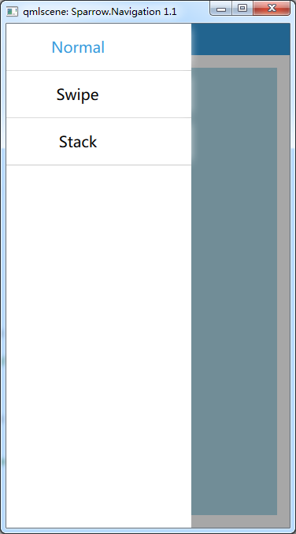

# Navigation

> Sparrow 2.0

> Inherits: Page

> objectName: "Sparrow.Navigation 2.0"

页面管理类。

## 属性

+ `navigationItems` : `list<NavigationItem>` **default**

+ `drawer` : `Drawer`

+ `navigationBar` : `NavigationBar`  **readonly**

+ `pages` : `list<Page>` **readonly**

+ `currentIndex` : `int`  **readonly**

+ `currentPage` : `Container` **readonly**

+ `count` : `int` **readonly**

## 方法

+ `void removeNavigationItem(int index)`

+ `NavigationItem insertNavigationItem (int index, Component component)`

## 详细描述

页面导航，支持抽屉式导航，滑动页面导航，页面栈导航。

```
import QtQuick 2.0
import QtQuick.Controls 1.4

import Sparrow 2.0


Navigation {
    drawer: Drawer { }
    NavigationItem {
        title: "Swipe"
        icon: "Swipe"
        NavigationSwipe {
            Page {
                navigationBarEnabled: true
                Rectangle {color:"red";anchors.fill: parent}
            }

            Page {
                navigationBarEnabled: false
                Rectangle {color:"green";anchors.fill: parent}
            }
        }
    }
    NavigationItem {
        title: "Stack"
        icon: "Stack"
        NavigationStack {
            Page {
                id: mainPage
                navigationBarEnabled: true
                Rectangle {color:"red";anchors.fill: parent}
                Button {
                    anchors.centerIn: parent
                    text: "push"
                    onClicked: {
                        mainPage.navigationStack.push(com);
                    }
                }
                Component {
                    id: com
                    Page {
                        id: secondPage
                        Rectangle {color:"yellow";anchors.fill: parent}
                        Button {
                            anchors.centerIn: parent
                            text: "pop"
                            onClicked: {
                                secondPage.navigationStack.pop();
                            }
                        }
                    }
                }
            }
        }
    }
}
```

## 属性文档

> ### `navigationItems` : `list<NavigationItem>` **default**

默认属性，保存所有的 `NavigationItem`。

> ### `drawer` : `Drawer`

抽屉式导航。

如下图：



> ### `navigationBar` : `NavigationBar`  **readonly**

导航条。

TODO

> ### `pages` : `list<Page>` **readonly**

管理的一级页面。

> ### `currentIndex` : `int`  **readonly**

当前页面下标。

> ### `currentPage` : `Container` **readonly**

当前页面引用。

> ### `count` : `int` **readonly**

`NavigationItem` 的个数。

## 方法文档

> ### `void removeNavigationItem(int index)`

移除指定下标的 `NavigationItem`。

> ### `NavigationItem insertNavigationItem (int index, Component component)`

指定位置，动态插入 `NavigationItem`。
